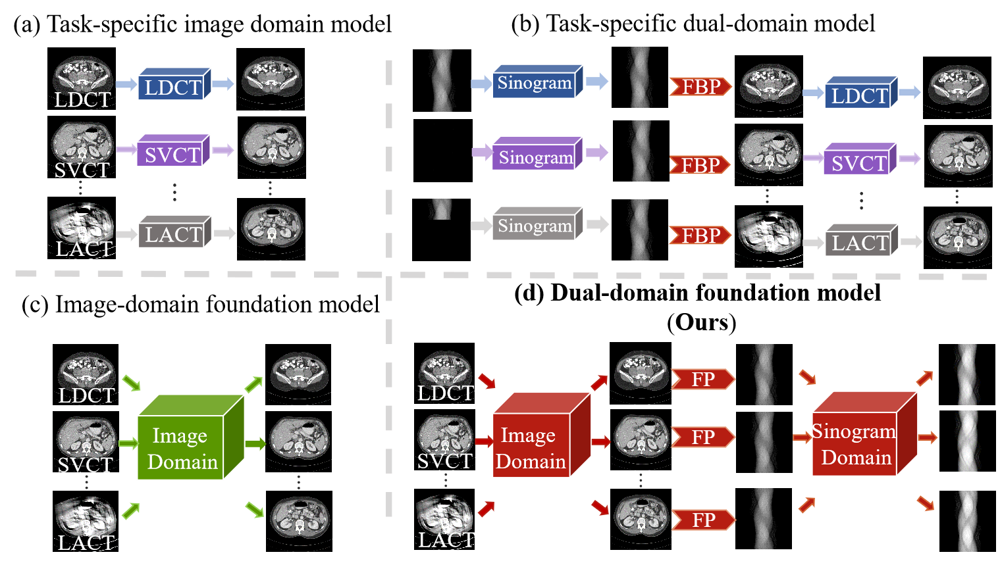
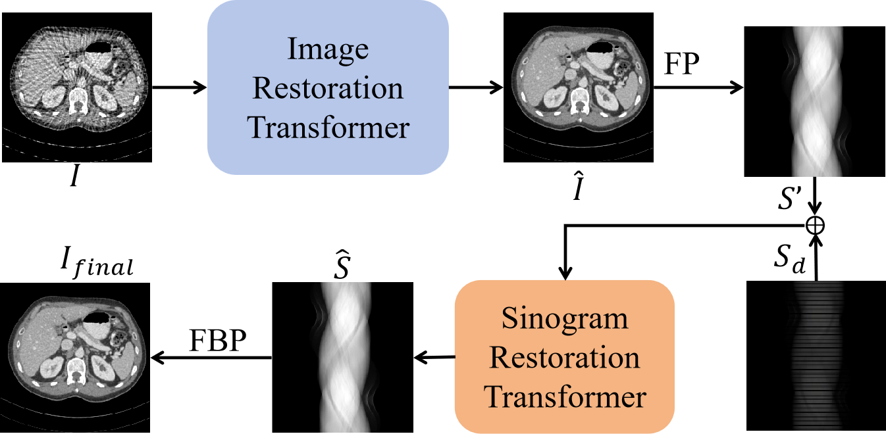
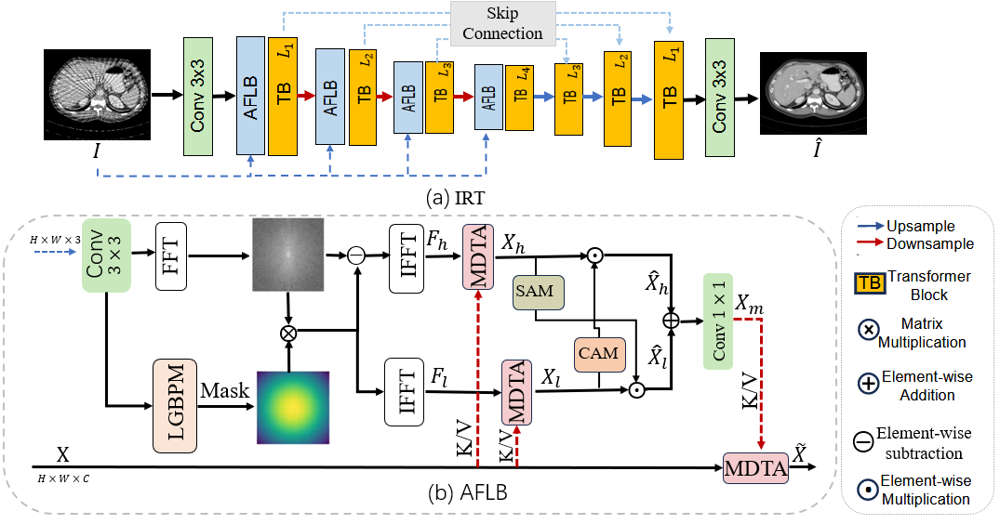
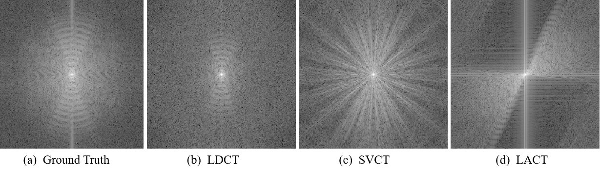
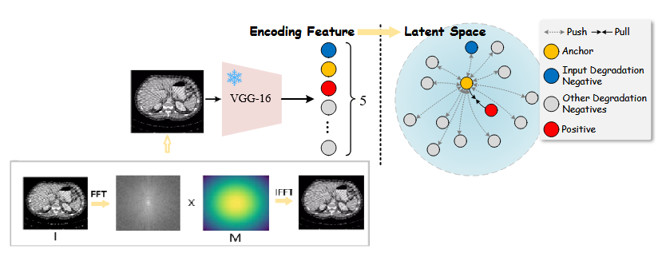

# CTPretrain

Dual-Domain Pretraining Foundation Model for CT Image Reconstruction [[paper](https://ieeexplore.ieee.org/abstract/document/11418634)]



<table width="100%">
  <tr>
    <td width="50%" align="center" style="padding: 0; border: none;">
      
    </td>
    <td width="50%" align="center" style="padding: 0; border: none;">
      
    </td>
  </tr>
</table>

<table width="100%">
  <tr>
    <td width="50%" align="center" style="padding: 0; border: none;">
      
    </td>
    <td width="50%" align="center" style="padding: 0; border: none;">
      
    </td>
  </tr>
</table>


## Supported Parameter Models
This project plans to release the following parameter models. Relevant weights and configuration files will be updated in the linked release page:

| Name       | Status         | Link                                                      |
| ---------- | -------------- | --------------------------------------------------------- |
| AAPM       | To be released | [Pending Release](https://github.com/LinY-ct/CTPretrain/) |
| DeepLesion | To be released | [Pending Release](https://github.com/LinY-ct/CTPretrain/) |
| Piglet     | To be released | [Pending Release](https://github.com/LinY-ct/CTPretrain/) |
| MAR        | To be released | [Pending Release](https://github.com/LinY-ct/CTPretrain/) |

##  Citation

```
@article{dai2026dual,
  title={Dual-Domain Pretraining Foundation Model for CT Image Reconstruction},
  author={Dai, Tao and Lin, Yang and Wang, Shuying and Qiu, Mengle and Feng, Changsheng and Guo, Hang and Ma, Jianhua and He, Ji},
  journal={IEEE Transactions on Radiation and Plasma Medical Sciences},
  year={2026},
  publisher={IEEE}
}
```
